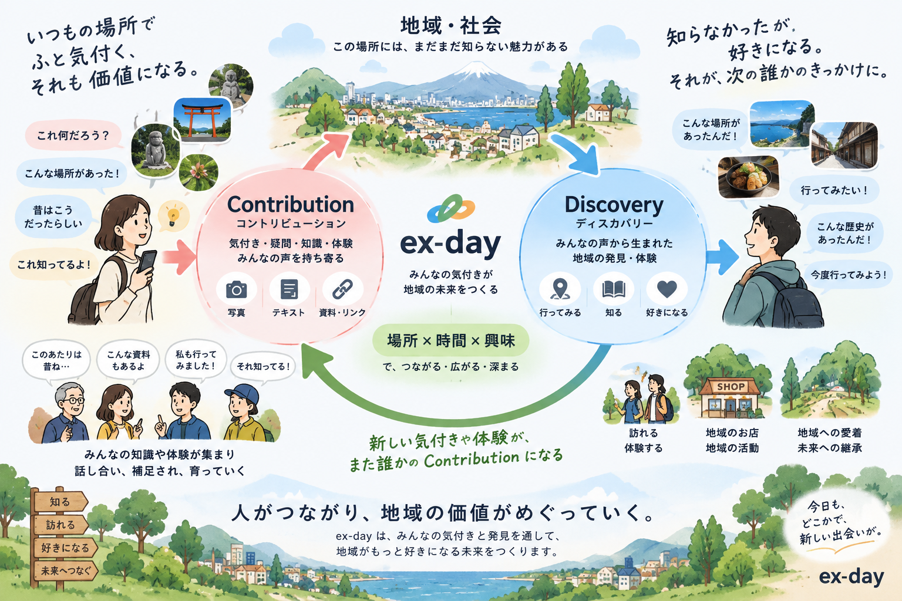
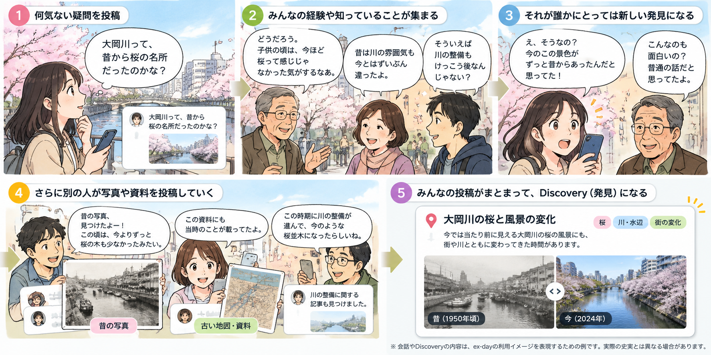

# ex-day

## 誰かの「当たり前」を、誰かの「発見」へ。

いつも歩いている道。  
旅行や仕事で、たまたま訪れた街。

そこには、その地域で暮らす人には当たり前でも、初めて訪れた人には知られていないことが、たくさんあります。

昔、この場所には何があったのか。  
この季節だから楽しめる食べ物や風景。  
そこで暮らしていた人だから覚えている、小さな記憶。

**誰かにとっての「当たり前」が、別の誰かにとっては、その場所を好きになるきっかけになるかもしれない。**

ex-dayは、地域にある知識・記憶・体験を、**場所 × 時間 × 興味**を通して、その人にとっての「発見（Discovery）」につなげるサービスを目指しています。

## 🔎 知らないことは、検索できない

たとえば、ある街が昔は温泉街だったこと。  
ある地域が、実は果物の産地であること。  
今は住宅地になっている場所に、かつて果樹園が広がっていたこと。

知っていれば、検索して詳しい情報を調べられるかもしれません。

でも、**そのこと自体を知らなければ、検索しようとは思いません。**

今いる場所や季節、使える時間、その人の興味から、

> 「そういえば、この場所にはこんな話があります」

と、まだ知らなかった何かに出会える。

誰かが残してくれた知識や体験が、次にその場所を訪れる人へ届き、何気なく通り過ぎていた街の見え方が少し変わる。そんなきっかけを作りたいと考えています。

たとえば、桜の季節に青森を訪れた人が、知らなかった「トゲクリガニ」に出会い、少し寄り道してみたくなる。次の漫画は、すでにあるDiscoveryが **場所 × 時間 × 興味** によって届き、行動につながる体験のイメージです。

## 💭 きっかけは、身近な場所への疑問でした

自分が育った街にある、東急東横線の綱島駅。

現在は高架上にある駅ですが、昔の写真を見ると、かつては地上を走っていたことを知りました。

そこで、ふと疑問が浮かびました。

> すぐ近くには鶴見川がある。  
> 今の堤防はかなり高い。  
> 地上を走っていた当時の鉄道は、どうやって川を渡っていたんだろう？

調べ始めると、鉄道だけでなく、街の姿、川、土地の高さ、かつての暮らしへと興味が広がっていきます。

そして、興味を持つ対象は大きな歴史だけではありません。

たとえば「青柳」という貝。現在の街の姿からはなかなか想像できませんが、かつて鶴見周辺でも採れていたという話があります。さらに、地元の人の昔話を聞いていると、

> 採れた青柳を干して、子供のおやつにしていた家庭もあった。

そんな話が出てきます。

**「ここで暮らしていた人たちは、どんな生活をしていたんだろう？」**

検索して見つかる情報もあれば、その土地で暮らした人の記憶の中に残っている話もあります。

そんな地域の「当たり前」を場所と結びつけて残し、誰かがその場所に興味を持つきっかけにできないだろうか。そこからex-dayのアイデアが少しずつ形になっていきました。

## 🗺️ 場所 × 時間 × 興味から、寄り道へ

たとえば出張先で仕事が終わり、

> 「帰りの新幹線まで、あと3時間ある。  
> せっかくここまで来たのだから、何か面白いものはないだろうか？」

と思ったとき。

今いる場所、帰る方向、使える時間、興味のあることから、

> **「だったら、ちょっとここに寄ってみませんか？」**

と提案できる。

あるいは、いつもの街を歩いているときに、

> 「実はこの辺り、昔は○○だったんですよ」

と教えてくれる。

ex-dayで扱いたいのは歴史だけではありません。地域のイベント、旬の食べ物、景色、お店、昔の暮らし。その場所でも、季節や時間、興味によって出会える面白さは変わります。

**「今いる場所」と「少しの時間」と「ちょっとした興味」から、いつもの一日が少し面白くなる。**

そんな体験を作りたいと考えています。

## 🌱 発見を増やし、育てるために

地域の知識や記憶は、最初からすべてが集まっているわけではありません。

誰かの発見につながる情報を増やしていくために、ex-dayでは、知っていることや体験したこと、写真や資料に加えて、まだ答えのない疑問も投稿できるようにしたいと考えています。こうした持ち寄りを、ex-dayでは **声** と呼んでいます。

古い写真を見つけて、

> 「この場所、今はどうなっているんだろう？」

街を歩いていて、

> 「この建物の入口だけ、なぜ道路より高いんだろう？」

そんな疑問に、その地域を昔から知っている人が記憶を添え、資料を持っている人が写真を持ち寄る。それぞれの知識がつながれば、一人では分からなかった街の姿が見えてくるかもしれません。

次の漫画では、「大岡川って昔から桜の名所だったのかな？」という疑問をきっかけに、みんなの記憶や資料が集まり、新しいDiscoveryが育っていく様子を描いています。

すでに誰かが残してくれた知識が、別の人の発見になる。疑問や会話からも、新しい発見が育っていく。

**その一つひとつを、場所・時間・興味が合う次の誰かへ届けたい。**

声や会話は、そんなDiscoveryを増やし、育てるための仕組みです。

## 🍻 発見が、次の発見につながる

地域のことを知ると、それ自体がちょっとした会話のきっかけになります。

旅先や仕事先、場合によってはお酒の席でたまたま隣になった人と、

> 「昔、この辺って○○だったらしいですね」

なんて話から、その土地の昔話に花が咲くこともあります。

そこで聞いた記憶や、実際に訪れて気づいたことを残せば、それがまた次の誰かの発見につながるかもしれません。

**知ったことが、実際の場所や人との新しいつながりを作る。**

そんな体験の積み重ねで、地域の面白さが少しずつ伝わっていくサービスを目指しています。

## 🚄 最短ではなく、余白を楽しむ

ex-dayを考え始めた当初から、いつか実現したいと思っている体験があります。

たとえば、出張帰りに、

> 「仕事が終わった。自宅まで帰るにはまだ3時間くらい余裕がある。  
> 帰り道で、何か面白いものに出会えないだろうか？」

と思ったとき。

最短の経路で帰るだけでなく、**その余裕があるからこそ楽しめる寄り道を探す。**

現在地、帰る場所、使える時間、その人の興味、そしてその時期に出会えるDiscoveryをつなげて、

> **「だったら、途中でここに寄ってみませんか？」**

と提案する。今が旬の食べ物を味わったり、知らなかった街の一角を歩いたりしてから、家へ帰る。

ただの帰り道が、その日ならではの発見の時間になる。そんなふうに、日々の余白を楽しめるところまで、ex-dayを育てていきたいと考えています。

経路探索や交通情報の扱い、外部サービスの利用コストなど、技術・コスト面の課題が大きいため、この体験は現在の開発スコープには含めていません。すべてを自前で作ることにこだわらず、同じ方向を目指すサービスや技術が生まれれば、連携して実現するのも面白いと考えています。

## 🚧 現在のex-dayと、これからの記録

ex-dayは現在、サービスの設計・開発と技術検証を進めている段階です。このREADMEで紹介した体験を形にするため、利用シーンをもとに、必要な画面や仕組みを具体化しています。

考えたこと、迷ったこと、技術的な判断、実際に作ったものまで、できるだけオープンにしていきたいと考えています。

### Development Log

コンセプト・要求の整理から、サービス本体の設計・開発へ。技術検証は専用リポジトリに分け、試したことを本体の開発につなげています。詳しい進捗や背景は、それぞれの場所で記録していきます。

- **[platform](https://github.com/ex-day/platform)** — サービス本体。要求・設計・実装など、開発の中心です。
- **[poc](https://github.com/ex-day/poc)** — サービスを支える技術の検証。試した構成や検証内容をまとめます。
- **[note](https://note.com/brave_echium7688/m/m0dd5ba9b91af)** — ex-dayのアイデアがサービスになるまでの形成過程や、AIと一緒に考え、作る中での試行錯誤を伝えます。
- **Zenn**（準備中） — 技術検証の内容や、そこで得た知見を記事として伝えます。

## 🤝 一緒に育ててくれる人を探しています

ex-dayは、まだ作り始めたばかりです。

地域の昔のことを知っている人、古い写真や資料を持っている人、面白い場所や食べ物を知っている人、地域で活動している人。

**「これ知ってる」「こんなのがあったら面白そう」だけでも大歓迎です。**

コードを書いたり、デザインをしたりすることだけが参加ではありません。「昔、あそこに○○があったよ」という記憶も、誰かの発見につながる大切な手がかりになります。

サービスへのアイデアや感想、地域の話、技術的なツッコミなど、[GitHub Discussions の案内の投稿](https://github.com/orgs/ex-day/discussions/1)へのコメントなどで、気軽に話しかけてください。もちろん、一緒にサービスを考え、作ってみたい方も歓迎です。

**いつもの一日に、ちょっとした発見を。**
